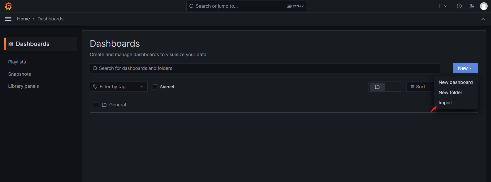
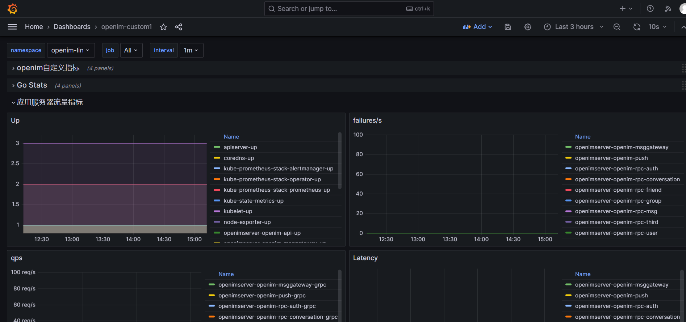
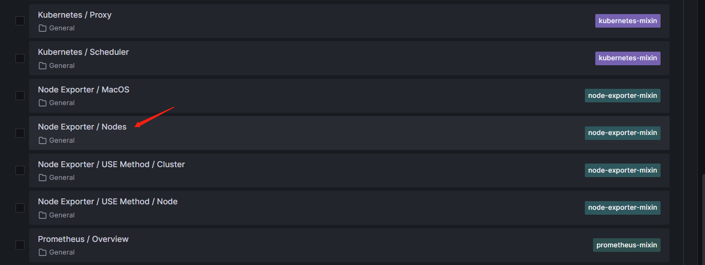
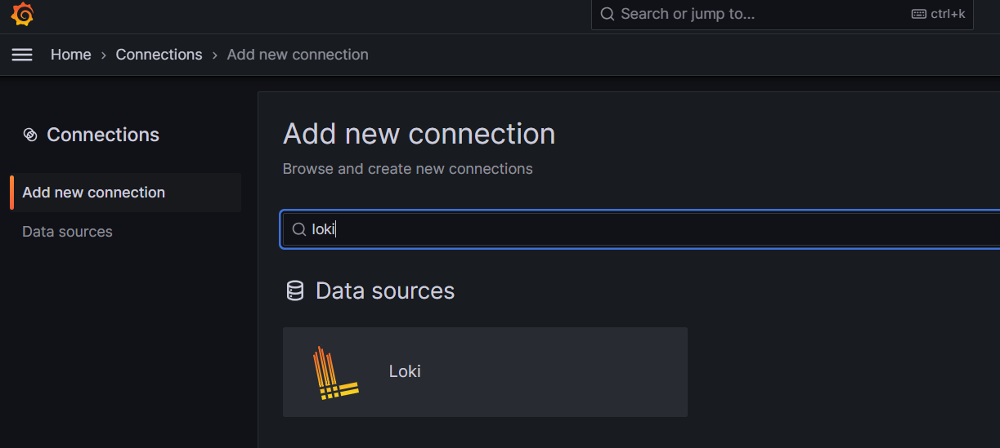
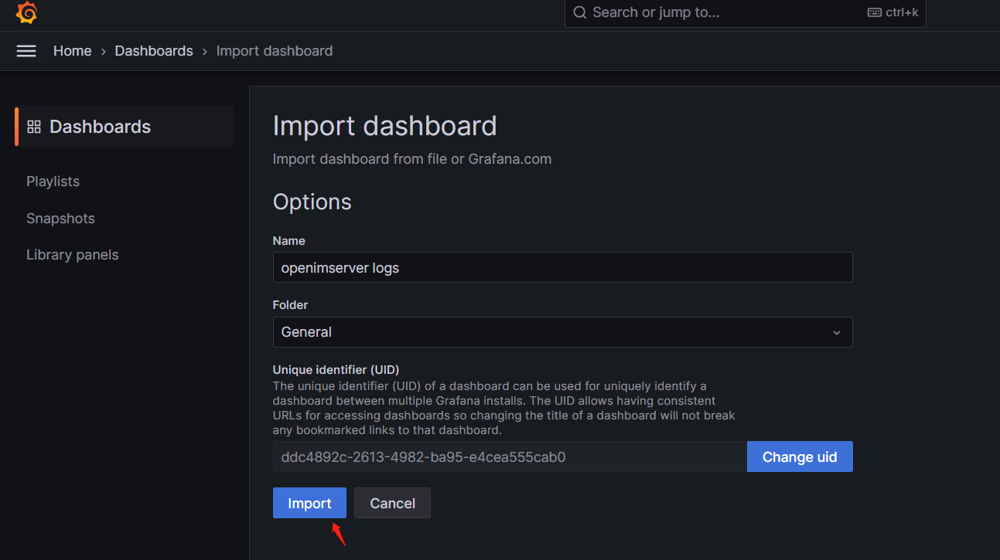

# User guide Documents

1. Using Grafana to View Openim Custom Metrics and System Performance Metrics(e.g. Node exposer) and Middleware Metrics(e.g. redis exposer,mongodb exposer)
2. Using Grafana to view logs collected by loki
## How to Open grafana website
1. through the domain name set during the installation of kube-prometheus-stack chart
2. through the openim-adminfront website
   + open adminfront website by:https://yourdomain/openim-admin-front/
   + Log in using the default username and password (admin1:admin1).
   + check the follow link,then will open grafana website.
   
## How to use grafana view metrics
1. log in grafana using the default username and password(admin:prom-operator)
2. The default Prometheus data source is already configured, 
   so in the second step, you only need to import the openim custom dashboard to view the openim custom metrics.
   + click the import button in follow picture
   
   + copy k8s-custom.yaml content to follow section,and click load button
   
   + select your k8s namespace ,and then you will view the openim custom metrics
   
3. view node metrics by the default Node exposer dashboard
   
   
## How to use grafana view logs 
1. add loki datasource
   
   + set loki datasource url= http://loki-stack:3100 ,and click save&test button
   
   
2. import log view dashboard using k8s-loki.yaml
   
   + then you will view the logs of openimserver
   

